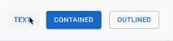
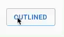
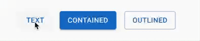
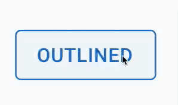
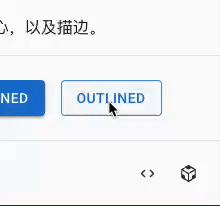

### 使用 JavaScript 实现按钮的涟漪效果

不知道你们有没有使用过 [Material UI](https://mui.com/zh/)。这是一个 React UI 组件库，它实现了 Google 的 Material Design。

Material Design 设计规范中包含了很多关于点击的涟漪效果，类似于一块石头跌落水中所产生的波浪效果。

以下是效果图







速度放慢之后的效果：



我们把 `overflow: hidden` 去掉之后：


本文就以 Material Design 中的涟漪效果作为目标，来使用原生的 JavaScript、CSS、HTML 来实现此效果。

### 分析

通过观察，我们可以发现点击的涟漪效果是在鼠标点击的点开始以一个正圆往外扩散。当圆形扩散到正好能将 Button 全部包围住的时候停止，在扩散的过程中颜色逐渐变浅直到消失，并且此效果可以叠加。

长按效果也是一个圆往外扩散，只不过是在长按结束之后，圆才会消失。

除了鼠标点击效果外，还有键盘焦点事件的效果。当使用键盘的 Tab 键切换到按钮上的时候，会有一个抖动的效果，类似于呼吸效果。

**我们提炼出几个比较关键的点：**

1. 从鼠标点击的位置开始扩散；
2. 是一个正圆形；
3. 圆形扩散到正好能将 Button 全部包围住的时候停止；
4. 长按效果；
5. 效果叠加；

第一点，我们可以通过 JavaScript 计算当前鼠标的坐标信息；第三点，获取 Button 四个顶点的坐标信息，再选一个距离鼠标最远的点，以它们的距离作为半径来画一个圆；第五点，每一个效果都是一个 dom 元素，每点击一次就追加一个 dom 元素，在动画结束的时候，移除此 dom；

### 实现

创建一个 index.html 文件，包含以下内容；

```html
<!-- index.html -->
<style>
  @import 'button.css';
  @import 'ripple.css';
</style>

<button class="button-root" id="ripple-example-button" type="button">
  Button
  <!-- 用来装涟漪效果的 DOM 的容器 -->
  <span class="ripple-root"></span>
</button>
```

创建 button.css 和 ripple.css，分别是 Button 的基础样式和涟漪效果的样式。

```css
/* button.css */
.button-root {
  position: relative;
  display: inline-flex;
  align-items: center;
  justify-content: center;
  padding: 6px 16px;
  font-size: 0.875rem;
  font-weight: 500;
  line-height: 1.75;
  min-width: 64px;
  margin: 0;
  border-radius: 4px;
  border: 1px solid rgba(25, 118, 210, 0.5);
  cursor: pointer;
  box-sizing: border-box;
  outline: none;
  appearance: none;
  user-select: none;
  color: #1976d2;
  background-color: transparent;
  transition-property: background-color, color, box-shadow, border-color;
  transition-duration: 0.25s;
}

.button-root:hover {
  background-color: rgba(25, 118, 210, 0.04);
  border: 1px solid #1976d2;
}
```

```css
/* ripple.css */
@keyframes enterKeyframe {
  0% {
    transform: scale(0);
    opacity: 0.1;
  }

  100% {
    transform: scale(1);
    opacity: 0.3;
  }
}

@keyframes exitKeyframe {
  0% {
    opacity: 1;
  }

  100% {
    opacity: 0;
  }
}

@keyframes pulsateKeyframe {
  0% {
    transform: scale(0.9);
  }

  50% {
    transform: scale(0.8);
  }

  100% {
    transform: scale(0.9);
  }
}

.ripple-root {
  display: block;
  position: absolute;
  overflow: hidden;
  width: 100%;
  height: 100%;
  top: 0;
  left: 0;
  right: 0;
  bottom: 0;
  pointer-events: none;
  background-color: transparent;
  z-index: 0;
  border-radius: inherit;
}

.ripple-root > .ripple-child {
  position: absolute;
  display: block;
  opacity: 0;
}

.ripple-root > .ripple-child.enter {
  opacity: 0.3;
  transform: scale(1);
  animation: enterKeyframe 550ms ease-in-out;
}

.ripple-root > .ripple-child > .ripple-child-child {
  opacity: 1;
  display: block;
  width: 100%;
  height: 100%;
  border-radius: 50%;
  background-color: currentColor;
}

.ripple-root > .ripple-child.exit > .ripple-child-child {
  opacity: 0;
  animation: exitKeyframe 550ms ease-in-out;
}

.ripple-root > .ripple-child.pulsate > .ripple-child-child {
  position: absolute;
  left: 0;
  top: 0;
  animation: pulsateKeyframe 2500ms ease-in-out 200ms infinite;
}
```

开始写 JavaScript。创建一个 ripple.apis.js 文件，编写 `startRipple` 函数。该函数首先要获取 Button 的位置信息和宽高。

```js
// ripple.apis.js
export function startRipple(event) {
  const { currentTarget: container } = event
  const { left, top, width, height } = container.getBoundingClientRect()
}
```

接着计算开始扩散的位置。

```js
// ripple.apis.js
export function startRipple(event) {
  // ...
  // 效果开始的坐标（相对于 Button）
  let rippleX, rippleY
  // 鼠标当前的坐标
  let clientX = 0, clientY = 0
 
 /**
  * 涟漪效果是否从节点的中心扩散，否则从鼠标点击的位置开始扩散
  * 使用 Tab 键移动焦点的时候，从节点的中心扩散
  */
  let center = false
  let isFocusVisible = false
 
  if (container.matches(':focus-visible')) {
    center = isFocusVisible = true
  } else {
    clientX = event.clientX
    clientY = event.clientY
  }
 
  rippleX = center ? width / 2 : clientX - left
  rippleY = center ? height / 2 : clientY - top
}
```

通过勾股定理，构造一个能正好包围当前元素的圆。

```js
// ripple.apis.js
export function startRipple(event) {
  // ...
  // 从鼠标点击的中心位置，构造一个能正好包围当前元素的圆
  const sizeX = Math.max(width - rippleX, rippleX) * 2
  const sizeY = Math.max(height - rippleY, rippleY) * 2
  const diagonal = Math.sqrt(sizeX ** 2 + sizeY ** 2)
}
```

再创建一个 `createRippleChild` 函数，用来创建涟漪效果的 DOM，并且使用一个全局变量来保存已经创建的 DOM。

```js
// ripple.apis.js
const rippleChildren = []

/**
 * 创建以下结构并返回：
 * <span class="ripple-child enter">
 *   <span class="ripple-child-child"></span>
 * </span>
 */
function createRippleChild(rect) {
  const rippleChild = document.createElement('span')
  rippleChild.classList.add('ripple-child', 'enter')
  const rippleChildChild = document.createElement('span')
  rippleChildChild.classList.add('ripple-child-child')
  rippleChild.appendChild(rippleChildChild)

  const { height, left, top, width } = rect
  rippleChild.style.height = height
  rippleChild.style.width = width
  rippleChild.style.top = top
  rippleChild.style.left = left

  rippleChildren.push(rippleChild)

  return rippleChild
}
```

回到 `startRipple` 函数，使用刚才创建的 `createRippleChild` 函数。

```js
// ripple.apis.js
export function startRipple(event) {
  // ...
  const rippleChild = createRippleChild({
    width: `${diagonal}px`,
    height: `${diagonal}px`,
    left: `${-diagonal / 2 + rippleX}px`,
    top: `${-diagonal / 2 + rippleY}px`,
  })
  if (isFocusVisible) {
    rippleChild.classList.add('pulsate')
  }
  const rippleRoot = container.querySelector(':scope > .ripple-root')
  rippleRoot.appendChild(rippleChild)
}
```

完成了 `startRipple` 函数之后，我们再创建一个 `stopRipple` 函数。该函数中，从 `rippleChildren` 取出最早创建的 DOM，添加一个动画结束的监听事件，在动画结束的时候，删除该 DOM。

```js
// ripple.apis.js
export function stopRipple() {
  const rippleChild = rippleChildren.shift()

  if (!rippleChild) return

  rippleChild.addEventListener('animationend', (event) => {
    if (event.animationName === 'exitKeyframe') {
      rippleChild.remove()
    }
  })
  rippleChild.classList.add('exit')
}
```

此时，我们已经完成了大部分的代码，接下来就是给 Button 绑定事件的时候了。在 index.html 文件中添加以下代码：

```html
<!-- index.html -->
<style>
  @import 'button.css';
  @import 'ripple.css';
</style>

<script type="module">
  import { startRipple, stopRipple } from 'ripple.apis.js'

  const button = document.querySelector('#ripple-example-button')

  button.addEventListener('mousedown', startRipple)
  button.addEventListener('focus', startRipple)
  button.addEventListener('mouseup', stopRipple)
  button.addEventListener('mouseleave', stopRipple)
  button.addEventListener('blur', stopRipple)
</script>

<button class="button-root" id="ripple-example-button" type="button">
  Button
  <!-- 用来装涟漪效果的 DOM 的容器 -->
  <span class="ripple-root"></span>
</button>
```

我们完成了所有的功能！[完整的代码](https://github.com/nnmax/blogs/tree/main/examples/ripple)在此仓库中。

也可以直接在 CodeSandbox 中编辑

[](https://codesandbox.io/s/ripple-0osvzy)