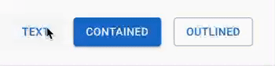
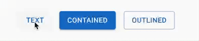

### 使用 JavaScript 实现按钮的涟漪效果

不知道你们有没有使用过 [Material UI](https://mui.com/zh/)。这是一个 React UI 组件库，它实现了 Google 的 Material Design。

Material Design 设计规范中包含了很多关于点击的涟漪效果，类似于一块石头跌落水中所产生的波浪效果。

本文就以 Material Design 中的涟漪效果作为目标，来使用原生的 JavaScript、CSS、HTML 来实现此效果。

### 分析

通过观察，我们可以发现点击的涟漪效果是在鼠标点击的点开始往外扩散，颜色逐渐变浅直到消失，并且此效果可以叠加。

而键盘焦点的效果则是类似于一个呼吸的效果，在按钮的中心有规律的抖动。

默认的涟漪效果太快了，我们可以下载 [Material UI 的 Git 仓库](https://github.com/mui/material-ui)到本地，通过本地调试来逐步分析。

